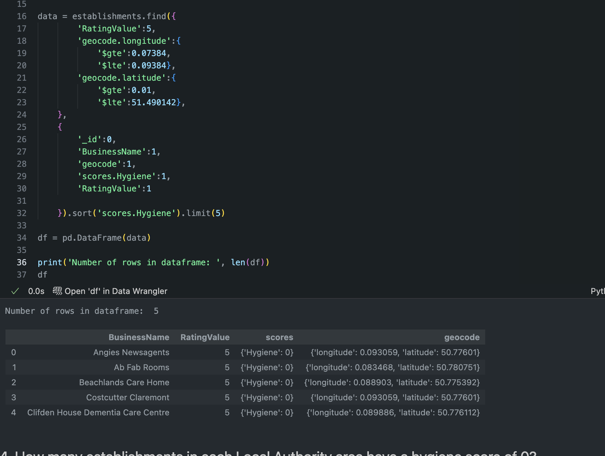

# nosql-challenge: Eat Safe, Love

I was contracted by the magazine Eat, Safe, Love to evaluate some of the ratings of restaurants across the United Kingdom that were published by the UK Food Standards Agency.

## Part 1: Database and Jupyter Notebook Set Up
1. First I imported the data in `establishments.json` from my Terminal, named the database `uk_food` and the collection `establishments`.
    - The line of code that I used to import the data was: 
        `mongoimport --db uk_food --collection establishments --drop --file C:\Users\geral\OneDrive\Documents\GitHub\nosql-challenge\Resources\establishments.json --jsonArray`

2. I imported the PyMongo and Pretty Print libraries and created an instance of Mongo Client.

3. I confirmed that there was a `uk_food` database and assigned the database to a variable name. I confirmed that there was a `establishments` collection in the database and assigned the collection to a variable name.

## Part 2: Update the Database
1. I created a dictionary for the restaurant `Penang Flavours` and used `insert_one()` to add it to the `establishments` collection.

2. I found the Business Type ID for `Restaurant/Cafe/Canteen` and updated `Penang Flavours` with its corresponding Business Type ID.

4. I found all the establishments in Dover and removed them from the collection.
    - The initial number of establishments in Dover was 994, after deleting the documents in Dover were 0.

5. I used `update_many()` to change the latitude and longitude values in the collection that were stored as strings to decimal numbers.

## Part 3: Exploratory Analysis
1. Which establishments have a hygiene score equal to 20?
    - I created a query searching for establishments with a hygiene score of 20 and used `count_documents()` to obtain the number of results.
        - There are 41 establishments with a hygiene score of 20.

    

2. Which establishments in London have a Rating Value greater than or equal to 4?
    - I created a query searching for establishments with London in their `LocalAuthorityName` and a rating value greater than or equal to 4.
        - The number of establishments in London with a rating greater than or equal to 4 is 34.

    

3. What are the top 5 establishments with a Rating Value of 5, sorted by lowest hygiene score, nearest to `Penang Flavours`?
    - I set the latitude and longitude variables to the latitude and longitude of Penang Flavours and set a degree search of 0.01, and calculated the latitude +- degree search and longitude +- degree search. I sorted the hygiene scores from lowest to greatest and limited the pipeline result to 5 to obtain the top 5 establishments closest to Penang Flavours.
        - The top 5 establishments closest to Penang Flavours are:

    

4. How many establishments in each Local Authority Area have a hygiene score of 0?
    - I created a match query looking for establishments with a hygiene score of 0. I created a group query grouping establishments by Local Authority Area and added all documents in each group to obtain the total number of establishments with a hygiene score of 0 in each local authority area. I sorted the values from highest to lowest.
        - There are a total of 55 local authority areas. These are the 10 local authority areas with the greatest number of establishments with a hygiene score of 0 (the number of establishments with a hygiene score of 0 is displayed next to the area name):

    
